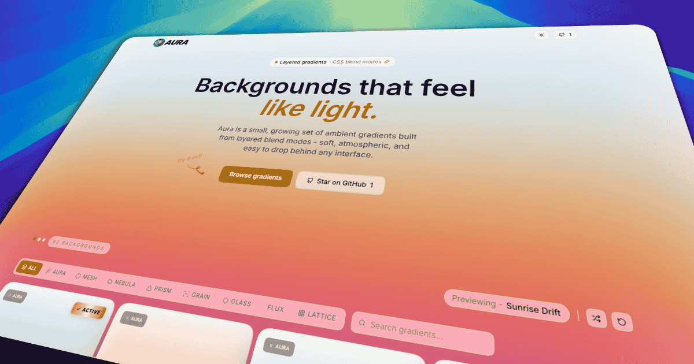

<div align="center">

# Gamma Studio

**Ambient gradient backgrounds — browse, customize, and ship.**

Layered CSS blend modes, a fullscreen editor, and one-click export for any stack.

<br />

[](https://studio.gammaui.com)
[](https://gammaui.com)
[](LICENSE)

[](https://nextjs.org)
[](https://react.dev)
[](https://tailwindcss.com)
[](https://www.typescriptlang.org)

<br />



<br />

[Website](https://studio.gammaui.com) · [Gamma UI](https://gammaui.com) · [Report bug](https://github.com/mazyar-kawa/gamma-studio/issues) · [Contribute](https://github.com/mazyar-kawa/gamma-studio)

</div>

---

## Overview

**Gamma Studio** is a free, open-source gradient gallery and generator. Pick from **600+** hand-tuned and procedural patterns, preview them live on your page, tune every layer in a fullscreen customizer, then copy production-ready code or download PNG/SVG.

Inspired by and built on top of [Aura](https://github.com/CristianOlivera1/Aura) by Cristian Olivera (MIT). Part of the [Gamma](https://gammaui.com) ecosystem alongside **Gamma UI** — motion-ready React components for shadcn/ui.

---

## Features

<table>
<tr>
<td width="50%">

### Gallery & preview
- **600+ patterns** across 12 categories
- **Live hover preview** on the full page
- **Featured** picks + search & filters
- **Favorites** saved in local storage
- **Dark / light** theme-aware backgrounds

</td>
<td width="50%">

### Customizer & export
- **Fullscreen editor** — layers, grain, blend modes
- **Undo / redo**, drag layer positions
- **Export** CSS, Tailwind, variables, CSS-in-JS
- **Download** PNG & SVG snapshots
- **AI prompt** — one click for ChatGPT / Claude

</td>
</tr>
</table>

### Categories

`Aura` · `Mesh` · `Nebula` · `Prism` · `Lattice` · `Grain` · `Glass` · `Flux` · `Aurora` · `Noise` · `Halo` · `Dusk`

---

## Quick start

**Requirements:** [Bun](https://bun.sh) (or Node.js 20+)

```bash
git clone https://github.com/mazyar-kawa/gamma-studio.git
cd gamma-studio
bun install
cp .env.example .env.local   # optional
bun dev
```

Open **[http://localhost:3000](http://localhost:3000)**.

| Command | Description |
| --- | --- |
| `bun dev` | Start dev server |
| `bun build` | Production build |
| `bun start` | Run production server |
| `bun lint` | Run ESLint |

---

## Environment variables

| Variable | Required | Description |
| --- | :---: | --- |
| `NEXT_PUBLIC_SITE_URL` | No | Canonical URL for Open Graph, sitemap & JSON-LD (`https://studio.gammaui.com`) |
| `GITHUB_TOKEN` | No | GitHub API token for star badge rate limits |

See [`.env.example`](.env.example).

---

## Deploy on Vercel

[](https://vercel.com/new/clone?repository-url=https://github.com/mazyar-kawa/gamma-studio)

Gamma Studio is designed to run on a **subdomain** so [gammaui.com](https://gammaui.com) stays your main Gamma UI site.

### Recommended domain

```
studio.gammaui.com  →  Gamma Studio (this repo)
gammaui.com         →  Gamma UI (main site)
```

### Steps

1. Import the repo in [Vercel](https://vercel.com)
2. **Settings → Domains** → add `studio.gammaui.com`
3. Add the DNS record at your registrar:

   | Type | Name | Value |
   | --- | --- | --- |
   | `CNAME` | `studio` | `cname.vercel-dns.com` |

4. **Settings → Environment Variables** → `NEXT_PUBLIC_SITE_URL=https://studio.gammaui.com`
5. Redeploy

---

## Tech stack

| Layer | Tools |
| --- | --- |
| Framework | Next.js 15 App Router, React 19 |
| Styling | Tailwind CSS v4, shadcn/ui, Radix |
| Motion | Motion |
| Export | html-to-image, prism-react-renderer |
| Icons | Lucide, Iconify |

---

## Project structure

```
src/
├── app/                 # Routes, layout, metadata
├── components/
│   ├── customizer/      # Fullscreen editor & export
│   ├── layout/          # Header, footer
│   └── ui/              # shadcn primitives
├── hooks/
└── lib/
    └── gradients/       # 600+ presets & categories
public/
└── images/metadata/     # OG image, favicons, PWA icons
```

---

## Credits

- **[Aura](https://github.com/CristianOlivera1/Aura)** — original gradient catalog & concept (MIT)
- **[Gamma UI](https://gammaui.com)** — sister component library

---

## License

[MIT](LICENSE) © Gamma Studio

Aura-derived presets remain under MIT with attribution to Cristian Olivera.

---

<div align="center">

**[studio.gammaui.com](https://studio.gammaui.com)** · Made with layered CSS & blend modes

</div>
